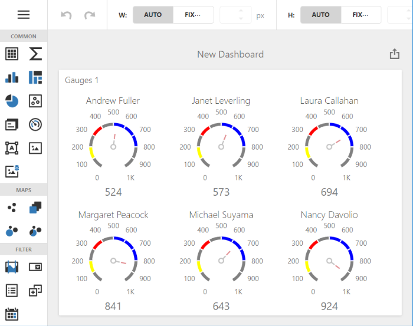

<!-- default badges list -->

<!-- default badges end -->
# Dashboard for Web Forms - How to use Custom Properties to Modify Ranges in the Gauge Dashboard Item 

This example shows how to edit [Ranges](https://js.devexpress.com/Documentation/Guide/UI_Components/CircularGauge/Visual_Elements/#Range_Container) for the [Gauge](https://docs.devexpress.com/Dashboard/117164/web-dashboard/create-dashboards-on-the-web/dashboard-item-settings/gauges) dashboard item. This functionality is not available in built-in Gauge settings. Use [Custom Properties](https://docs.devexpress.com/Dashboard/401702/web-dashboard/ui-elements-and-customization/create-custom-properties) to save and apply range settings.

You also need to modify ranges on the server side to display changes in the exported document. The [ASPxDashboard.CustomExport](https://docs.devexpress.com/Dashboard/DevExpress.DashboardWeb.ASPxDashboard.CustomExport) event is handled for this purpose.

The resulting dashboard looks as follows:

To modify ranges in the UI, go to the Gauge's [Item Menu](https://docs.devexpress.com/Dashboard/117446/web-dashboard/ui-elements-and-customization/ui-elements/dashboard-item-menu) → Options → Ranges (custom) → Edit.

## Files to Review

* [Default.aspx](./CS/Default.aspx)
* [Default.aspx.cs](./CS/Default.aspx.cs)
* [CustomRange.cs](./CS/Models/CustomRange.cs)
* [GaugeRangesExtension.js](./CS/GaugeRangesExtension.js)

## Documentation

- [Access to Underlying Widgets in ASP.NET Web Forms](https://docs.devexpress.com/Dashboard/117573/web-dashboard/aspnet-web-forms-dashboard-control/access-to-underlying-widgets)
- [Custom Properties](https://docs.devexpress.com/Dashboard/401702/web-dashboard/ui-elements-and-customization/custom-properties)
- [ASPxDashboard.CustomExport](https://docs.devexpress.com/Dashboard/DevExpress.DashboardWeb.ASPxDashboard.CustomExport)

## More Examples

- [Dashboard - Constant Lines](https://github.com/DevExpress-Examples/dashboard-constant-lines)
- [Dashboard for Web Forms - How to access API of underlying widgets](https://github.com/DevExpress-Examples/how-to-access-api-of-underlying-widgets-in-the-aspnet-dashboard-control-t492396)
<!-- feedback -->
## Does this example address your development requirements/objectives?

 

(you will be redirected to DevExpress.com to submit your response)
<!-- feedback end -->
